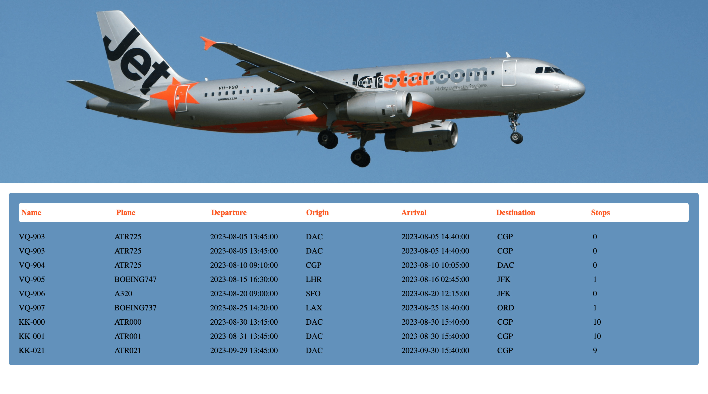

# Image gallery



> A page displaying flight times.

## Table of contents

- [General info](#general-info)
- [Screenshots](#screenshots)
- [Technologies](#technologies)
- [Setup](#setup)
- [Features](#features)
- [Status](#status)
- [Inspiration](#inspiration)
- [Contact](#contact)

## General info

> The objective of the project is to practice separation of concern in
> JavaScript.


## Technologies

- JavaScript
- HTML5
- CSS3
- VSC code

## Setup

clone the repo and use npm init to initialize the project (install all the dependencies).

## Code Examples

```js
const loadEvent = () => {
    window.addEventListener('load', loadHandler);
}
```

## Features

List of features ready and Todos for future development

- Follow all flight details fron one table.

To-do list:

- Add a delete button for each line of flight.

## Status

Project is: completed
